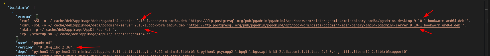

# PgAdmin4 packaged into AppImage

https://www.pgadmin.org

## To build pgadmin4 AppImage

NOTE: To build the image you must first install docker. Please visit https://www.docker.com/ for installation instructions.

Required utilities (for debian)

```
sudo apt install wget libfuse2 fuse make
```

1. step: Build the docker image

```
make build-docker
```

2. step: Modify the pgadmin4.json file to have the wanted version of the pgadmin4 files




3. step: Build the app

```
make
```

4. step: To test run AppImage (the &lt;version&gt; is your current version for pgadmin4. e.g. 9.10)

```
./pgadmin4-<version>-glibc_2.36-x86_64.AppImage
```

## To remove generated AppImages

```
make clean
```

## Tools used:

- https://github.com/simoniz0r/deb2appimage
- https://github.com/AppImage/AppImageKit

